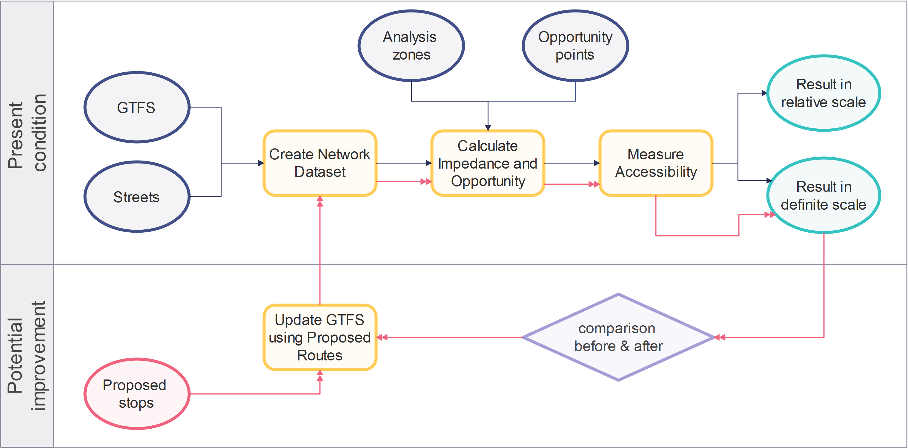

# Transit Accessibility Analyst for ArcGIS Pro

With Transit Accessibility Analyst (TAA), we provide you a one-stop experience of measuring accessibility provided by public transit systems. 

## 1. Description
TAA is a Python toolbox for ArcGIS Pro. It is written in Python with the assistance from the ArcPy site package, and open-source Python packages, NumPy and pandas. TAA offers four tools:
1. Create Network Dataset
2. Calculate Impedance and Opportunity
3. Measure Accessibility
4. Update GTFS using Proposed Routes

TAA can help transit planners to (a) create transit network, (b) calculate impedance/opportunity based on the specified opportunity points, (c) measure accessibility through different scales and metrics, and (d) modify the GTFS dataset based on the input of proposed route and stop locations. TAA streamlines the process of measuring transit accessibility through modularization. However, it still maintains high flexibility and configurability inside individual tools. 

**_Note_**
- The first tool requires using a [transit network template](datasets/TransitNetworkTemplate.xml) developed by ESRI. For more information, please visit [Network Analyst ArcGIS Pro Tutorial Data](https://www.arcgis.com/home/item.html?id=c18b87f786c4462fab34ade571f7a025).
- Software compatibility: [ArcGIS Pro 2.6](https://pro.arcgis.com/en/pro-app/get-started/whats-new-in-arcgis-pro.htm)